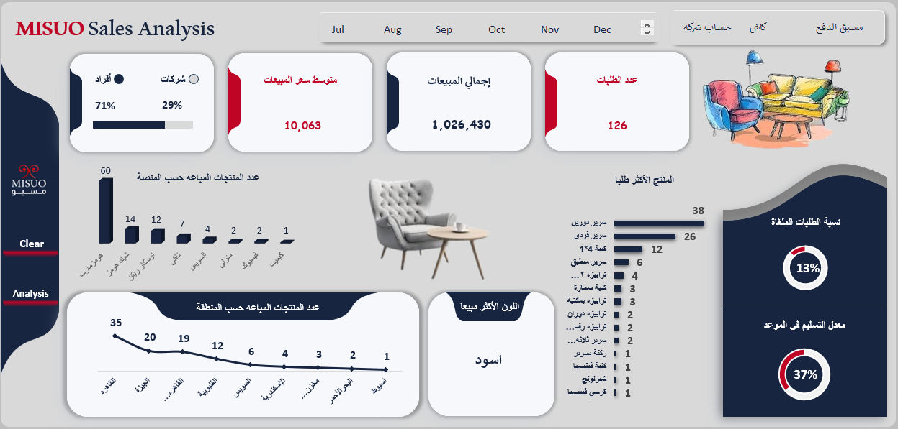

  

# 🪑 Furniture Sales Dashboard (Excel Project)

## 📊 Overview
This project analyzes furniture sales data using an Excel dashboard to extract meaningful insights about sales performance, customer behavior, and product trends across different sales platforms.

The dashboard helps transform raw data into clear metrics that support better business decisions.

---

## 🎯 Objective
- Analyze overall sales performance
- Compare sales across different platforms
- Identify best-selling products and colors
- Understand customer type behavior
- Evaluate order status (delivered vs cancelled)

---

## 📌 Key KPIs
- Number of Orders  
- Total Revenue  
- Average Order Value (AOV)  
- Customer Type Distribution (Corporate vs Individual)  

---

## 📊 Key Insights
- Certain platforms contribute significantly higher sales volume than others.
- A small number of products generate the majority of sales.
- Specific colors are more preferred by customers, influencing purchasing behavior.
- Order cancellation rate highlights potential operational issues.
- On-time delivery rate plays a key role in customer satisfaction.

---

## 💡 Recommendations
- Focus marketing efforts on high-performing platforms.
- Optimize inventory for top-selling products and colors.
- Investigate reasons behind order cancellations.
- Improve delivery processes to increase on-time delivery rate.
- Enhance product availability based on demand trends.

---

## 🛠️ Tools Used
- Microsoft Excel  
- Pivot Tables  
- Charts & Dashboards  
- Data Cleaning & Analysis  

---

## 🔗 Project Sharing

👉 LinkedIn Case Study: https://www.linkedin.com/posts/aml-ghazy-b1a50b3a4_dashboard-dataanalysis-excel-share-7415916024895827968-kIa9?utm_source=share&utm_medium=member_desktop&rcm=ACoAAGMIDIYBHodAL2wtNlFwkDPUWM0DzigmRgk
---

